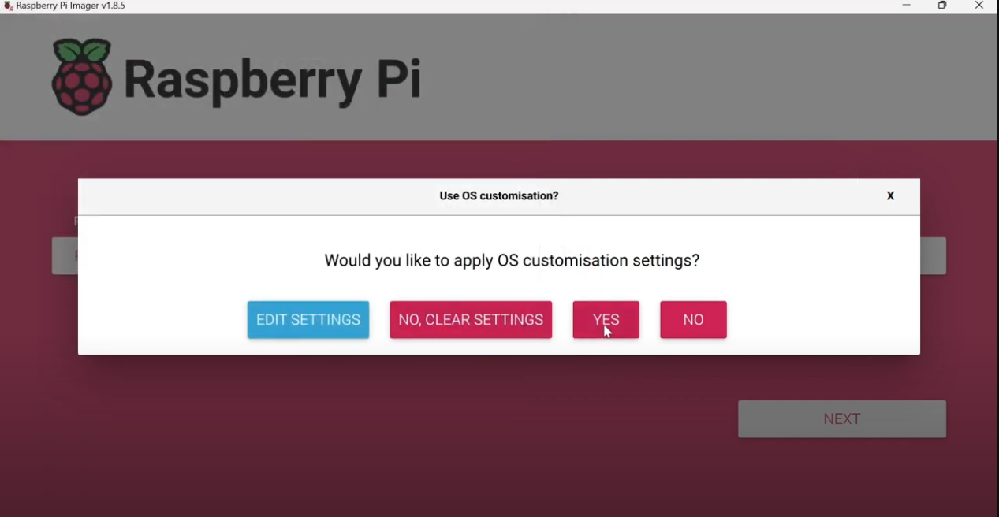

# Setting Up a Raspberry Pi Headless (SSH) Connection
{: .no_toc }

By: Connor Robinson, Aidan Costello, Thomas Elpers, Abel Lu

By following these steps, you’ll be able to connect to your Raspberry Pi headless using SSH and Nmap. 🎩🍓

<details open markdown="block">
  <summary>
    Table of contents
  </summary>
  {: .text-delta }
 - TOC
{:toc}
</details>

**Walkthrough video (Windows 11):**

<iframe width="560" height="315" src="https://www.youtube.com/embed/o2a6wr9Srbo?si=cfXeTQYpk4pfM4qc" title="YouTube video player" frameborder="0" allow="accelerometer; autoplay; clipboard-write; encrypted-media; gyroscope; picture-in-picture; web-share" referrerpolicy="strict-origin-when-cross-origin" allowfullscreen></iframe>


## 1. Get the Raspberry Pi Imager:

 - Visit the official [*Raspberry Pi website*](https://www.raspberrypi.com/software/) or the [*GitHub repository*](https://github.com/raspberrypi/rpi-imager) to download the Raspberry Pi Imager tool.

 - Choose the version suitable for your operating system (Windows, macOS, or Linux).

## 2. Download the Correct OS for the Pi:

 - Launch the Raspberry Pi Imager tool.

 - Click *Choose Device* and select your Raspberry Pi model from the list of devices

    <details closed markdown="block">
    <summary>
        Show image
    </summary>
    {: .text-delta }
    
    
    {: .text-delta }
    </details>
 
 - Click *Choose OS* and select the appropriate operating system for your Raspberry Pi. For headless setup (without a graphical user interface), consider using **Raspberry Pi OS Lite** (under *Raspberry Pi OS (other)*).

    <details closed markdown="block">
    <summary>
        Show image
    </summary>
    {: .text-delta }
    
    {: .text-delta }
    </details>

 - Click *Choose Storage* and select your microSD card.

    {: .warning }
    > Flashing an OS will replace **EVERTHING** on the microSD card. Be sure to transfer any important files first!

    <details closed markdown="block">
    <summary>
        Show image
    </summary>
    {: .text-delta }
    
    {: .text-delta }
    </details>

- Click the *Next* button to proceed.

## 3. Configure Settings in the Imager:

**Before writing the OS image to the microSD card, we need to configure Wi-Fi and enable SSH:**

 - After clicking *Next* there will be a prompt to apply OS customizations. Click *Edit Settings*

    <details closed markdown="block">
    <summary>
        Show image
    </summary>
    {: .text-delta }
    
    {: .text-delta }
    </details>

 - In the *General* tab:

    <details closed markdown="block">
    <summary>
        Show image
    </summary>
    {: .text-delta }
    
    {: .text-delta }
    </details>

    1. Deselect the *Set hostname* option

    1. Click on *Configure wireless LAN* and enter your Wi-Fi credentials.

 - Enable SSH by clicking on *Services* and checking the *SSH* option.

    <details closed markdown="block">
    <summary>
        Show image
    </summary>
    {: .text-delta }
    
    {: .text-delta }
    </details>

 - Exit the OS customization window and then click *Yes* to apply the customizations.

    <details closed markdown="block">
    <summary>
        Show image
    </summary>
    {: .text-delta }
    
    {: .text-delta }
    </details>

## 4. Download the CLI Version of Nmap:

 - Visit the official Nmap website and download the command-line version suitable for your operating system.

 - Follow the installation instructions provided for your platform.

{: .important }
> Ensure that *Register Nmap Path* is selected when installing.
>
>    <details closed markdown="block">
>    <summary>
>        Show image
>    </summary>
>    {: .text-delta }
>    
>    {: .text-delta }
>    </details>


## 5. Open Your Computer's CLI:





Open the *Command Prompt*: 
- Search for "cmd" in the Start menu
- Alternatively, press `Win+R` and type `cmd`





Open the *Terminal* application (you can find it in the Utilities folder within Applications).





 - Ensure Nmap was installed by entering the following into your terminal.

    ```sh
    nmap -v
    ```

- You should see something like

    ```
    Starting Nmap 7.80 ( https://nmap.org ) at 2024-04-06 19:52 EDT
    Read data files from: /usr/bin/../share/nmap
    WARNING: No targets were specified, so 0 hosts scanned.
    Nmap done: 0 IP addresses (0 hosts up) scanned in 0.02 seconds
    ```

## 6. Run the Correct Nmap Scan:

 - Use Nmap to scan your local network for devices:

    ```sh
    nmap -sn 192.168.1.0/24
    ```

 - Replace `192.168.1.0/24` with your actual network range.

## 7. Decipher Which Open Port is Your Raspberry Pi:

 - Look for an open SSH port (default is port 22) associated with a device in the scan results. Note down the IP address of the Raspberry Pi.

## 8. SSH into Your Raspberry Pi:





You'll need an SSH client like [PuTTY](https://www.putty.org/) or [OpenSSH](https://learn.microsoft.com/en-us/windows-server/administration/openssh/openssh_install_firstuse?tabs=gui).

Open PuTTY:

 1. Enter the Raspberry Pi's IP address and click *Open*

 1. Log in with the username (pi) and password (default is raspberry).





Open the Terminal and use SSH to connect to your Raspberry Pi. (Replace `<RaspberryPi_IP>` with the IP address you noted down.):

```sh
ssh pi@<RaspberryPi_IP>
```





## 9. Make a New File:

 - Once connected via SSH your terminal prompt should change to the default of your Raspberry Pi's OS

    <details closed markdown="block">
    <summary>
        Show image
    </summary>
    {: .text-delta }
    
    {: .text-delta }
    </details>
 
 - As a quick test, create a new file with the following command

    ```sh
    touch hello_world.txt
    ```

## 10. Exit from Raspberry Pi:

 - To exit from the Raspberry Pi terminal, type:

    ```sh
    exit
    ```

## 11. Test the Connection Again:

 - Repeat step 8 to SSH into your Raspberry Pi and ensure you can still connect successfully.

 - Enter the following command:

    ```sh
    ls -la
    ```

 - You should see a list of files including the `hello_world.txt` file we made earlier.

**Success!!**

Now you have access to your Raspberry Pi using SSH and Nmap! 🎩🍓
